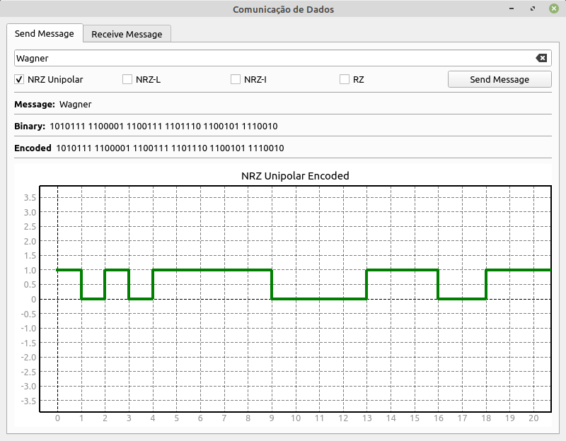
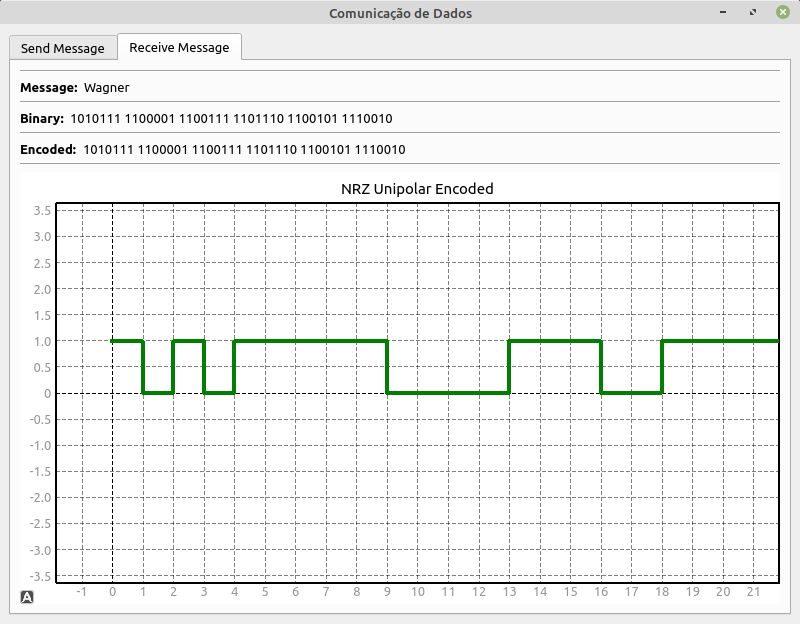

# Binary Sequence Sending Simulator

Project developed by the students of the Computer Engineering course of the Federal Technological University of Paraná (UTFPR) for the subject of Computer Networks in the 5th Period.

## Obejective

Simulate the execution of NRZ and RZ algorithms that are used in telecommunications for information transfer.

## Result

The application opens a socket communication to send the data that is "encrypted" using the selected algorithm before being sent. The following images show the interface.

    

    

## Dependencies

The application was developed using python and PyQt5, so the following python packages are required: <strong>pyqtgraph<strong> and <strong>PyQt5<strong>
